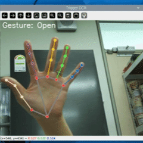

# 🖐️ handMini2: Hand Gesture-based OCR Trigger System on Raspberry Pi

> 손 제스처(Open / Pointer)를 활용해 영역을 선택하고, 키보드 입력 없이 OCR을 수행할 수 있는 라즈베리파이 최적화 제스처 기반 OCR 트리거 시스템이다.

## 주요 기능

- Raspberry Pi 5 + Picamera2 기반 실시간 영상 처리
- MediaPipe를 통한 손 랜드마크 추적 및 제스처 인식
- 제스처로 영역 선택(Open → Pointer → Open)
- 키보드 입력(o/r)으로 OCR 실행 또는 재시작
- OCR 대상 영역은 선택된 사각형 ROI를 기준으로 추출
- OCR 함수(`recognize_text`) 호출 후 결과 출력

## 제스처 인식 흐름

| 제스처  | 기능 설명                          |
|--------|-----------------------------------|
| Open   | OCR 캡처 모드 토글 (ON/OFF 전환)   |
| Pointer| 사각형 좌표 지정 (최대 2점까지)     |

```
[Open] → [Pointer] → [Pointer] → [Open] → [o] 실행
```

- Open 제스처로 캡처 모드 시작/종료
- Pointer 제스처로 마우스 좌표 2개 수집 → ROI 생성
- 'o' 키를 누르면 해당 ROI에 대해 OCR 수행
- 'r' 키를 누르면 ROI 재설정

## 데모 시연

                
## 설치 방법 (Raspberry Pi 5 기준)

```bash

sudo apt update
sudo apt install python3-opencv python3-picamera2 python3-tk

# 가상환경 및 필요한 패키지 설치
python3 -m venv .venv
source .venv/bin/activate
pip install --no-deps tflite-runtime
pip install --no-deps opencv-python
pip install mediapipe==0.10.9
pip install simplejpeg
pip install numpy==1.24.4
```

## 실행 방법

```bash
python inference_landmark_ocr.py
```

## 주의사항

- PiCamera2 모듈은 Raspberry Pi OS Bookworm에서 지원된다.
- OCR은 `ocr_bridge.py` 내 `recognize_text()` 함수로 연결되며, 현재는 dummy 코드이기 때문에 추후 실제 OCR 모델을 여기에 연동하면 된다.
- 정확한 제스처를 인식하려면 손이 카메라 프레임 안에 잘 위치해야 한다.
  
## 사용한 모델 출처

본 프로젝트에서 사용한 손 제스처 분류기 모델(`keypoint_classifier.tflite`)은 아래 오픈소스를 기반으로 추가 데이터 재학습 및 커스터마이징하였다.

- 출처: [kinivi/hand-gesture-recognition-mediapipe](https://github.com/kinivi/hand-gesture-recognition-mediapipe)  

---

🔗 GitHub: [mogld/handMini2](https://github.com/mogld/handMini2)
